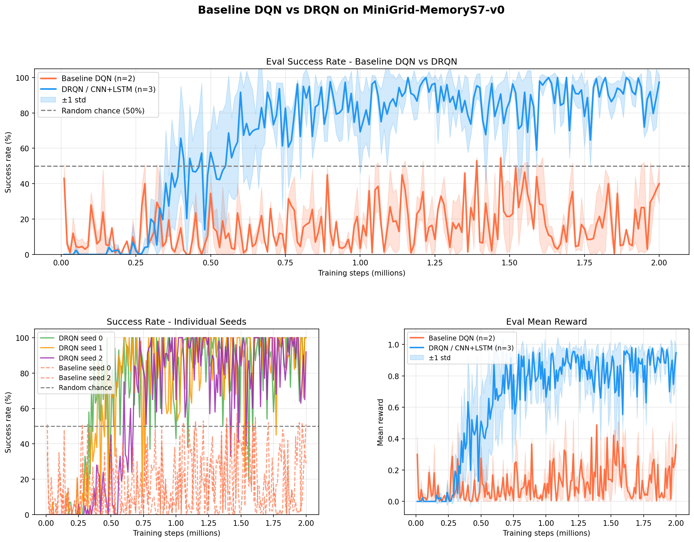

# DQN: Reproducing and Extending Classical Reinforcement Learning

**Track 1: DQN** — Reproducing Mnih et al. (2015) and adapting to a memory-dependent environment.

## Project Overview

This project has two phases:

| Phase | Environment | Goal | Status |
|-------|------------|------|--------|
| **Phase 1: Reproduction** | ALE Breakout (Atari) | Train DQN from pixels, show it learns | Complete |
| **Phase 2: Adaptation** | MiniGrid MemoryEnv | Add recurrent memory (DRQN) to handle partial observability | Complete |

## Paper Reference

**Human-level control through deep reinforcement learning** — Mnih et al., Nature, 2015

Key ideas reproduced:
- CNN Q-network learning directly from raw pixels (84x84 grayscale)
- Experience replay buffer for stable training
- Separate target network (hard-copied every 10k steps)
- Epsilon-greedy exploration with linear decay
- Reward clipping to {-1, 0, +1}
- Frame stacking (4 frames), frame skipping (4), max over last 2 frames

## Repository Structure

```
├── src/
│   ├── model.py            # CNN Q-network (3 conv + 2 FC, matches paper Table 1)
│   ├── dqn_agent.py        # DQN agent (epsilon-greedy, training, target sync)
│   ├── replay_buffer.py    # Uniform experience replay
│   └── wrappers.py         # Atari preprocessing (NoOp, MaxSkip, EpisodicLife, etc.)
├── configs/
│   ├── breakout.json       # Base config
│   ├── breakout_5m.json    # 5M step config
│   └── breakout_10m.json   # 10M step config (used for final results)
├── train_atari.py                # Phase 1: DQN Atari training script
├── train_minigrid.py             # Phase 2: Baseline DQN on MiniGrid
├── train_minigrid_drqn.py        # Phase 2: DRQN (DQN + LSTM) on MiniGrid
├── train_minigrid_framestack.py  # Phase 2 ablation: DQN with K-frame stacking (no LSTM)
├── plot_results.py         # Atari result plots
├── plot_results_minigrid.py # MiniGrid result plots
├── DQN_Breakout_Colab.ipynb # Google Colab notebook (Drive checkpoints + auto-resume)
├── results/
│   ├── runs/               # TensorBoard logs
│   ├── checkpoints/        # Model checkpoints (.pt files)
│   └── training_3seeds.png # Phase 1 results plot
└── Final_Project.pdf       # Project assignment specification
```

## Setup Instructions

### Local (Windows, NVIDIA GPU)

```bash
conda create -n dqn python=3.11 -y
conda activate dqn
pip install torch torchvision --index-url https://download.pytorch.org/whl/cu128
pip install "gymnasium[atari]" ale-py opencv-python tensorboard matplotlib
```

### Local (Mac / Linux)

```bash
conda create -n dqn python=3.11 -y
conda activate dqn
pip install torch torchvision gymnasium "gymnasium[atari]" ale-py autorom \
    minigrid tensorboard matplotlib numpy opencv-python-headless
AutoROM --accept-license
```

### Google Colab

Upload `DQN_Breakout_Colab.ipynb` to Colab. It handles all installation, saves checkpoints to Google Drive, and auto-resumes after disconnects.

## Training

### Phase 1: Atari Breakout

```bash
conda activate dqn

# Single run
python train_atari.py --config configs/breakout_10m.json --seed 0 --device cuda

# Run all 3 seeds (chained)
python train_atari.py --config configs/breakout_10m.json --seed 0 --device cuda && \
python train_atari.py --config configs/breakout_10m.json --seed 1 --device cuda && \
python train_atari.py --config configs/breakout_10m.json --seed 2 --device cuda

# Plot
python plot_results.py
```

### Phase 2: MiniGrid MemoryEnv

```bash
conda activate dqn

# Baseline DQN (2M steps, 3 seeds)
run_baseline_2m_seed0.bat  # or: python train_minigrid.py --seed 0 --total-steps 2000000
run_baseline_2m_seed1.bat
run_baseline_2m_seed2.bat

# DRQN (2M steps, sequence length 10, 3 seeds)
run_drqn_seed0.bat  # or: python train_minigrid_drqn.py --seed 0 --seq-len 10 --total-steps 2000000
run_drqn_seed1.bat
run_drqn_seed2.bat

# Monitor all runs
tensorboard --logdir results/runs

# Plot MiniGrid results
python plot_results_minigrid.py
```

### Phase 2 Ablation: Frame-stacking DQN (Mac, per teammate)

The ablation tests whether the **LSTM recurrence** is what made DRQN work, or
whether simply giving the CNN more context (the last K frames) is enough.
Same CNN, same hyperparameters as the baseline — the only change is stacking
the last 10 frames along the channel axis instead of using an LSTM.

Three teammates, one seed each:

| Teammate  | Seed | Launcher                     |
|-----------|------|------------------------------|
| Mia       | 0    | `./run_framestack_seed0.sh`  |
| Carolina  | 1    | `./run_framestack_seed1.sh`  |
| Yamilet   | 2    | `./run_framestack_seed2.sh`  |

#### One-time setup (each Mac)
```bash
conda create -n dqn python=3.11 -y
conda activate dqn
pip install torch torchvision gymnasium minigrid \
    tensorboard matplotlib numpy opencv-python-headless
```

#### Pull latest code
```bash
cd path/to/dqn
git pull
```

#### Run YOUR seed
Use `caffeinate -i` so the Mac doesn't sleep mid-run:
```bash
caffeinate -i ./run_framestack_seed0.sh   # change 0 to your seed
```

Expect **~8–12 hrs on Apple Silicon** (2M steps, single seed). Keep the laptop
lid open — `caffeinate -i` prevents idle sleep but not lid-close sleep.
If you need to close the lid, run this first (and undo with `0` when done):
```bash
sudo pmset -a disablesleep 1
```

First eval prints at step 10,000. If `eval_reward` is sensible by step ~50k,
it's safe to walk away. If the run errors early, stop and flag it — don't let
a broken run burn 12 hrs of compute.

#### Monitor (optional, second terminal)
```bash
conda activate dqn
tensorboard --logdir results/runs
# open http://localhost:6006 and look for memory_framestack_seed{YOUR_SEED}_*
```

#### Push YOUR results when done

`results/` and `*.pt` are in `.gitignore`, so force-add **only your seed's files**:
```bash
# replace 0 with your seed number in both paths
git pull
git add -f results/runs/memory_framestack_seed0_K10_*/
git add -f results/checkpoints/memory_framestack_seed0_K10.pt

git status   # sanity: 1 TB log + 1 .pt (~5 MB total)
git commit -m "Add framestack ablation: seed 0, 2M steps"
git push
```

If two people push at the same time: `git pull --rebase && git push`. No
conflicts — each seed writes to its own uniquely-timestamped folder.

Do **not** run `git add -f results/` — that would sweep up 230 MB of other
teammates' files.

## Hyperparameters

### Phase 1: DQN (Atari Breakout)

| Parameter | Our Value | Paper Value | Notes |
|-----------|----------|-------------|-------|
| Total steps | 10M (=40M frames) | 50M frames | Scaled down for feasibility |
| Replay buffer | 200,000 | 1,000,000 | Reduced for memory constraints (~32 GB RAM) |
| Batch size | 32 | 32 | Same |
| Discount (γ) | 0.99 | 0.99 | Same |
| Learning rate | 1e-4 (Adam) | 2.5e-4 (RMSProp) | Different optimizer |
| Epsilon start | 1.0 | 1.0 | Same |
| Epsilon end | 0.1 | 0.1 | Same |
| Epsilon decay | 1M steps | 1M frames (~250k steps) | Ours decays 4x slower |
| Target update freq | 10,000 steps | 10,000 steps | Same |
| Frame skip | 4 | 4 | Same |
| Frame stack | 4 | 4 | Same |
| Input size | 84x84 grayscale | 84x84 grayscale | Same |

### Phase 2: DRQN (MiniGrid MemoryEnv)

| Parameter | Value |
|-----------|-------|
| Total steps | 2M |
| Architecture | CNN (3 conv) → LSTM (hidden=256) → FC |
| Sequence length (L) | 10 |
| Batch size | 16 sequences |
| Replay buffer | 2,000 episodes |
| Discount (γ) | 0.99 |
| Learning rate | 1e-4 (Adam) |
| Epsilon start / end | 1.0 / 0.1 |
| Epsilon decay | 150,000 steps |
| Target update freq | 1,000 steps |
| Training freq | Every 4 steps |
| Learning starts | 2,000 steps |
| Input | 56×56 RGB partial observation |

## Results

### Phase 1: Breakout Reproduction (Complete)

All 3 seeds trained for 10M steps on NVIDIA RTX PRO 500 Blackwell GPU (~165 FPS).

| Seed | Final Eval Reward | Peak Eval Reward |
|------|------------------|-----------------|
| 0 | 55.9 | 64.7 |
| 1 | 54.4 | 63.7 |
| 2 | 45.8 | 63.9 |
| **Mean ± Std** | **52.0 ± 5.3** | — |


- **Top**: Mean ± std eval reward across 3 seeds (unclipped, full 5-life games)
- **Bottom left**: Individual seed curves
- **Bottom right**: 100-episode rolling average training reward (clipped)

**Comparison to paper:**

| Agent | Breakout Score |
|-------|---------------|
| Random | 1.7 |
| Human | 31.8 |
| **Our DQN (10M steps, mean)** | **52.0 ± 5.3** |
| Paper DQN (50M frames) | 401.2 |

Our agent surpasses human-level performance. The gap to the paper's 401 is explained by: smaller replay buffer (200k vs 1M), fewer training frames (10M vs 50M agent steps), and slower epsilon decay.

### Phase 2: MiniGrid MemoryEnv (Complete)

Environment: `MiniGrid-MemoryS7-v0` — agent must remember an object seen at the start of the episode and identify a matching object later. Requires memory across timesteps; a memoryless agent performs near chance (~50%).

#### Baseline DQN (no memory, 2M steps)

| Seed | Final Eval Reward | Best Eval Reward | Final Success Rate | Best Success Rate |
|------|------------------|-----------------|-------------------|------------------|
| 0 | 0.286 | 0.521 | 29.0% | 57.0% |

The baseline DQN fails to consistently solve the task, confirming that feedforward Q-networks cannot reliably bridge the memory gap.

#### DRQN (CNN + LSTM, sequence length 10, 2M steps)

| Seed | Final Eval Reward | Best Eval Reward | Final Success Rate | Best Success Rate |
|------|------------------|-----------------|-------------------|------------------|
| 0 | 0.979 | 0.980 | **100%** | 100% |
| 1 | 0.962 | 0.981 | **100%** | 100% |
| 2 | 0.900 | 0.980 | 92% | 100% |

DRQN achieves near-perfect performance across all seeds, with all three seeds reaching 100% success rate at some point during training. The recurrent state allows the agent to remember the target object across the full episode.



## Known Issues & Divergences from Paper

1. **Eval reporting bug (fixed):** Early runs used reward clipping and EpisodicLifeWrapper during evaluation, which reported artificially low scores (~5-7 instead of actual ~50+). Fixed in commit `7b3d853`.

2. **Replay buffer size:** Paper uses 1M transitions. We use 200k due to RAM constraints (1M would require ~56 GB).

3. **Epsilon decay mismatch:** Our epsilon decays over 1M agent steps (= 4M environment frames). The paper decays over 1M environment frames (= 250k agent steps). Our agent explores randomly for 4x longer.

4. **Optimizer:** Paper uses RMSProp (lr=0.00025, α=0.95, ε=0.01). We use Adam (lr=1e-4).

## Environment Versions

- Python: 3.11
- PyTorch: 2.11.0+cu128
- Gymnasium: 1.2.3
- ALE-py: 0.11.2

## Compute

| Run | Device | Steps | Approx Time |
|-----|--------|-------|-------------|
| Breakout seed 0 (2M) | Apple M4 MPS | 2M | ~3 hours |
| Breakout seed 0 (10M) | NVIDIA RTX PRO 500 Blackwell | 10M | ~17 hours |
| Breakout seed 1 (10M) | NVIDIA RTX PRO 500 Blackwell | 10M | ~17 hours |
| Breakout seed 2 (10M) | NVIDIA RTX PRO 500 Blackwell | 10M | ~17 hours |
| Baseline DQN seed 0 (2M) | mias-macbook-air-3023 | 2M | ~2 hours |
| DRQN seed 0 (2M) | NVIDIA RTX PRO 500 Blackwell | 2M | ~5 hours |
| DRQN seed 1 (2M) | NVIDIA RTX PRO 500 Blackwell | 2M | ~5 hours |
| DRQN seed 2 (2M) | NVIDIA RTX PRO 500 Blackwell | 2M | ~5 hours |

## References

- Mnih et al. (2015). *Human-level control through deep reinforcement learning*. Nature.
- [ALE / Gymnasium](https://github.com/Farama-Foundation/Arcade-Learning-Environment)
